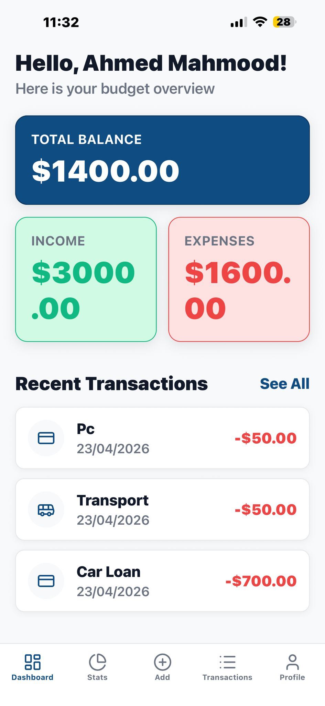
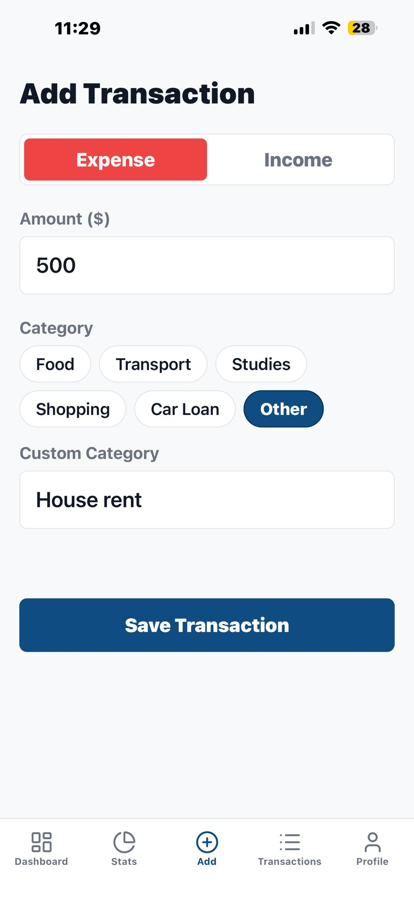
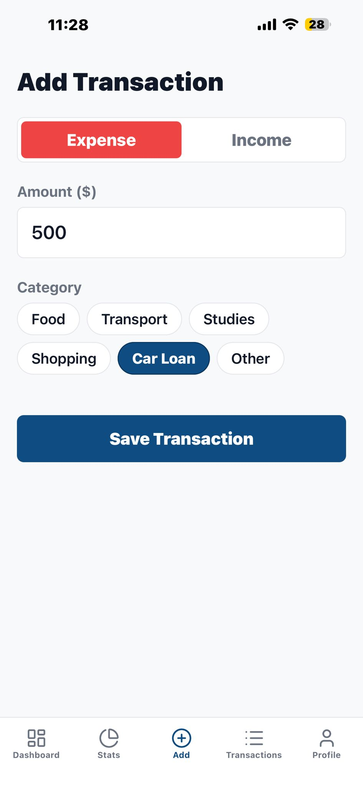
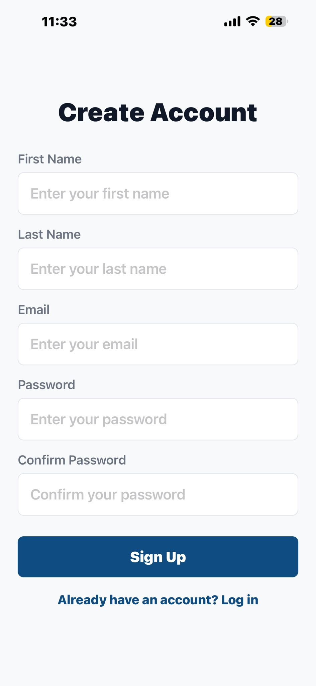
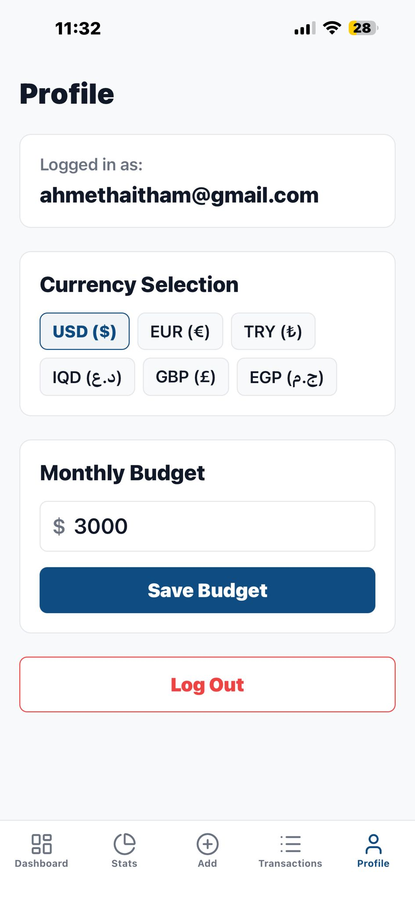
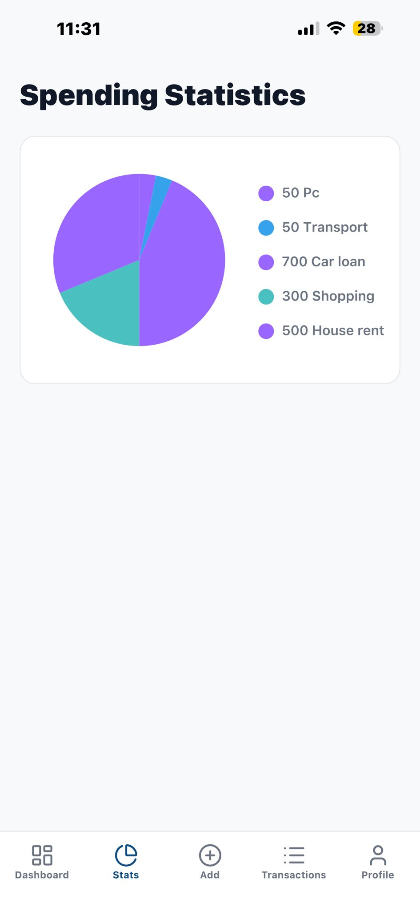

# 💰 Expense Tracker Mobile App

  
  
  

---

## About the Project

A smart app to manage personal finances. It helps users track their daily expenses, categorize transactions, and visualize spending habits to achieve financial goals seamlessly.

## Key Features

- **Real-time tracking**: Instantly monitor your balance, income, and expenses.
- **Smart Categorization**: Assign transactions to default or custom categories for detailed tracking.
- **Visual Analytics**: Analyze your financial data with dynamic, easy-to-read charts.
- **Firebase Cloud Sync**: Securely store and synchronize your data across all devices in real-time.
- **Secure Auth**: Safe and reliable user registration and authentication powered by Firebase.

## Tech Stack

**Frontend**: 
- React Native
- Expo

**Backend**: 
- Firebase Firestore (Database)
- Firebase Authentication (Auth)

## Screenshots

 |  |  |
| **User Profile** | **App Settings** | **Transaction History** |
|  |  |  |
  

